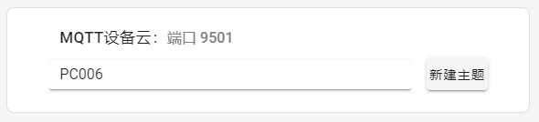
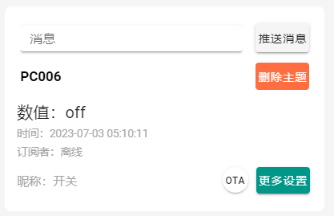
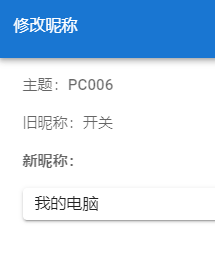
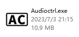
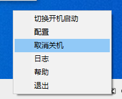

# AudioCtrl教程
这是一个免费的小工具，可以通过小爱同学、天猫精灵之类的智能音响，或手机自带的语音助手来控制电脑关机。无需添置硬件，软件即可实现。

如果您感兴趣的话还可以经过一些配置来通过语音助手运行自定义脚本。

## 快速上手
### 创建设备
到巴法云网站注册一个账号：[https://cloud.bemfa.com/](https://cloud.bemfa.com/)

点击右上角的控制台，在随后的界面左边找到你的**私钥**，点击眼睛按钮显示

记录下这串文字，稍后会用到

在画面中间找到**MQTT设备云**，点击

在接下来的界面右上角找到MQTT设备云，在文字框中输入一个**设备名**，设备名的结尾必须是006，例如PC006，前面的字母可以根据自己的喜好命名。命名完毕以后点击**新建主题**，并记录下这个设备名，稍后会用到。

创建主题以后，可以在下方找到刚刚创建的设备

用鼠标点击昵称，即可给设备起一个方便记忆的名字，这个名字是后面呼叫语音助手时候需要用到的名字，比如**“我的电脑”。**

点击确认以后，可以关闭网页，至此设备创建完毕。

### 软件配置
下载最新版的软件

[https://gitee.com/z779750025/AudioCtrl/releases](https://gitee.com/z779750025/AudioCtrl/releases)

解压打开后，用Windows自带的记事本打开config.ini文件

分别填写client\_id和topic

client\_id就是之前记下的**私钥**，大概长这样：bdxxxx200ae24be89a9cxxxx759axxxx

topic就是刚刚的**设备名**，以006结尾的那个，例如：PC006

填写完毕保存退出。

点击AudioCtrl.exe,打开软件，这时屏幕右下角的托盘图标里将会出现这个图标，说明启动成功。可以进行接下来的语音助手配置。

如果启动失败报错，请确认自己的配置信息有没有填错，如果信息正确依然无法启动，请邮件反馈至paomao@paomao.cc ，我会尽快排查修复。

### 语音助手配置
#### 小爱同学
下载米家app，在米家app-->我的-->其他平台设备-->点击添加-->找到"巴法"，输入巴法云账号即可，设备会自动同步到米家，即可通过小爱同学控制设备。

#### 天猫精灵
打开天猫精灵app，在app中搜索：巴法云。找到巴法云技能，点击绑定账号，登陆你的巴法云账号，登陆成功后，上一步骤新建的设备就自动同步到天猫精灵了，现在可以使用天猫精灵来控制了，设备可在<天猫精灵app-->我家>中查看。

#### 小度音箱
下载小度音箱app或者小度app，在app首页点+号-->添加设备-->搜索巴法，找到"巴法"，输入巴法云账号即可，设备会自动同步到小度，即可通过小度音箱控制设备。

#### 其他设备
暂未进行测试，巴法云官方提供了诸多平台的[接入介绍](https://cloud.bemfa.com/docs/#/)，但需要一定的电脑知识才可以看懂。

感兴趣的同学可以测试并反馈给我，感谢！

### 用语音关闭电脑
唤醒家里的小爱同学、天猫精灵等智能音响，或者小米手机的小爱同学，说出“关闭XXX”（XXX是刚刚给设备起的**昵称**，比如“我的电脑”），电脑会弹出提示窗口，倒计时1分钟后关机。

1分钟以内还可以反悔，右键点击托盘图标，点击取消关机，即可反悔。

### 自定义脚本
需要一些电脑知识，或简单的编程能力，也可以去问ChatGPT，让它帮你写。

对语音助手使用口令“打开XXX”（XXX是设备的**昵称**），会唤起自定义脚本，自定义脚本是位于AudioCtrl程序目录下的run.bat文件，在这个文件内编写自己需要的功能即可。

### 问题与反馈
使用过程中遇到问题或bug请发送邮件到paomao@paomao.cc

我会定期查看并修复。

### 常见问题
暂无，待大家反馈后整理。